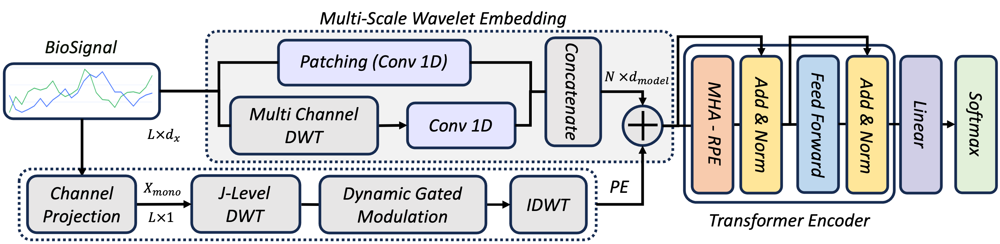
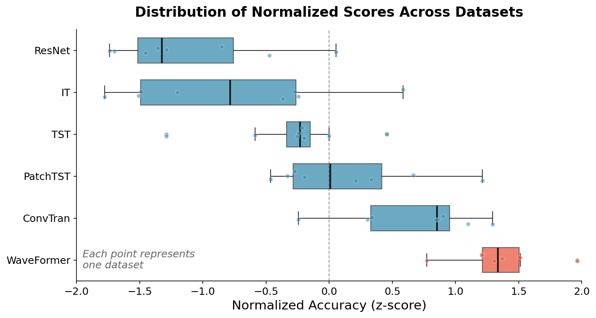
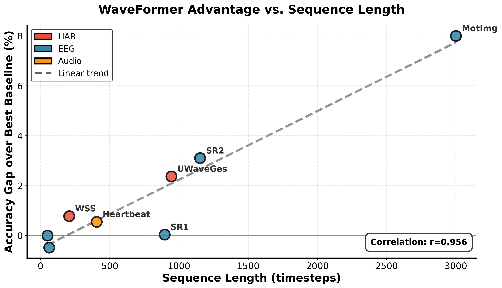

## WaveFormer: Wavelet Embedding Transformer for Biomedical Signals

[](https://www.python.org/downloads/release/python-380/)
[](https://pytorch.org/)
[](https://opensource.org/licenses/MIT)
[](https://arxiv.org/abs/2602.12189)

This is a PyTorch implementation of "WaveFormer: Wavelet Embedding Transformer for Biomedical Signals"

<p align="center">
  
</p>

### Overview

WaveFormer is a transformer architecture that integrates wavelet decomposition at two critical stages: embedding construction, where multi-channel Discrete Wavelet Transform (DWT) extracts frequency features to create tokens containing both time-domain and frequency-domain information, and positional encoding, where Dynamic Wavelet Positional Encoding (DyWPE) adapts position embeddings to signal-specific temporal structure through mono-channel DWT analysis.

### Methodology

#### Mathematical Framework
For input `x ∈ ℝ^(B×L×d_x)`:

**Wavelet-Enhanced Patch Embedding**

1. **DWT to each channel**: `cA, cD = DWT(x)  # Approximation (low-freq) + Detail (high-freq)`
2. **Wavelet-Derived Frequency Features**: `W_input = cA + α·cD`
3. **Fusion**: `E_patches = [Conv1d(x^T) ; Conv1d(W_input)]^T  # Concatenate`

**Dynamic Wavelet Positional Encoding (DyWPE)**

1. **Channel Projection**: `x_mono = x · w_channel`
2. **Multi-Level DWT**: `(cA_J, [cD_J, ..., cD_1]) = DWT(x_mono)`
3. **Gated Modulation**: `modulated_coeffs = gate(scale_embeddings, coeffs)`
4. **IDWT Synthesis**: `P_DyWPE = IDWT(modulated_coeffs)`

**Combines token content with position information**: `E_final = E_patches + P_DyWPE  # Concatenate`


### Installation

```bash
git clone https://github.com/imics-lab/waveformer.git
cd waveformer
pip install -r requirements.txt
```

#### Dependencies

```
torch>=1.9.0
numpy>=1.20.0
pandas>=1.3.0
matplotlib>=3.4.0
scikit-learn>=1.0.0
pytorch_wavelets>=1.3.0
```

#### Repository Structure

```
waveformer/
├── src/
│   ├── models/
│   │   ├── waveformer.py           # Main WaveFormer model
│   │   ├── embeddings.py           # Wavelet-enhanced patch embedding
│   │   ├── dywpe.py                # Dynamic Wavelet Positional Encoding
│   │   └── transformer.py          # Transformer encoder with RPE
│   └── utils/
│       ├── metrics.py              # Evaluation metrics
│       └── visualization.py        # Plotting utilities              
├── scripts/
│   └── run_example.py  
│   └── run_ablation_study.py  
└── README.md                 
```


#### Usage
```python
from models.waveformer import WaveFormer


# Initialize WaveFormer
model = WaveFormer(
        input_timesteps= SEQ_LENGTH,         # Sequence length
        in_channels= INPUT_CHANNELS,         # Number of input channels
        patch_size=PATCH_SIZE,               # Patch size for embedding
        embedding_dim=EMBED_DIM.             # Embedding dimension
        num_transformer_layers=NUM_LAYERS,   # Number of transformer layers (4, 8, etc.)
        num_heads=N_HEADS,                   # Number of attention heads
        num_layers=NUM_LAYERS,               # Number of transformer layers
        dim_feedforward=DIM_FF,              # Feedforward dimension
        dropout=DROPOUT,                     # Dropout rate (0.1, 0.2, etc.)
        num_classes= NUM_CLASSES             # Number of output classes
        use_wavelet_embedding=True,          # Enable wavelet-enhanced embedding
        use_dywpe=True,                      # Enable DyWPE
        use_rpe=True                         # Enable bucketing RPE
    )


# Forward pass
x = torch.randn(BATCH_SIZE, SEQ_LENGTH, INPUT_CHANNELS)  # (batch, sequence, features)
output = model(x)
```

### Results

Our comprehensive evaluation across 8 diverse time series datasets demonstrates WaveFormer's superior performance compared to state-of-the-art Deep learning models.

#### Performance Overview

<p align="center">
  
  
  <br>
  <em><strong>Left:</strong> Distribution of z-score normalized classification accuracy across 8 datasets. WaveFormer shows the highest median performance and most consistent results. 
  <strong>Right:</strong> Performance advantage versus sequence length. WaveFormer's accuracy improvement over the best baseline correlates positively with sequence length, with largest gains on long sequences.</em>
</p>

For detailed experimental results and ablation studies, please refer to our [paper](https://arxiv.org/abs/2602.12189).


### Contributing

Pull requests are welcome. For major changes, please open an issue first to discuss what you would like to change.

Please make sure to update tests as appropriate.

### License

This project is licensed under the MIT License - see the [LICENSE](LICENSE) file for details.


### Citation

If you find **WaveFormer** useful for your research, please consider citing this repository using the following information:

```bibtex
@article{irani2026waveformer,
  title={WaveFormer: Wavelet Embedding Transformer for Biomedical Signals},
  author={Habib Irani and Bikram De and Vangelis Metsis},
  journal={arXiv preprint arXiv:2602.12189},
  year={2026}
}
```

